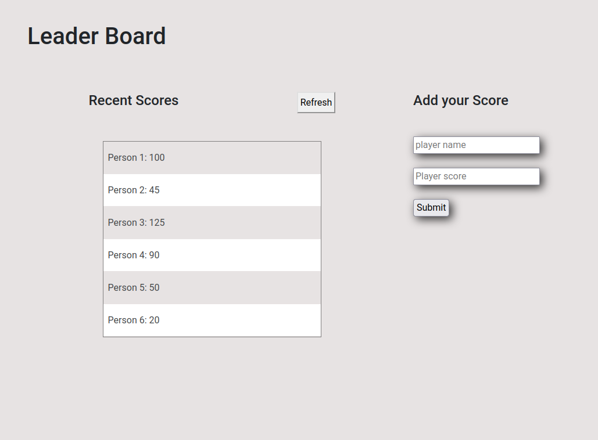

# Leaderboard

The leaderboard website displays scores submitted by different players. It also allows you to submit your score. All data is preserved thanks to the external Leaderboard API service.

## Live Demo

## Project Requirement

- Create an npm project with webpack. (If you need a refresher, check the previous project or webpack exercise).
- Write plain HTML markup with minimum styling (just to make the layout), because you will implement styles in the following steps. Use this wireframe as a guide:
Basic UI
- Don't make API calls (you'll do it in a following lesson).
- Use ES6 modules, with import and export.

## Built With

- Webpack
- Linters included: (Lighthouse, Webhint, Stylelint)
- Features of webpack and plugins already inlcuded 
   1. style-loader
   2. css loader
   3. HtmlWebpackPlugin
   4. WebPack Dev Server
   

## Usage

1. Navigate to your desired directory in your local machine using the terminal.

2. Clone repository by running `git clone git@github.com:AdedayoOpeyemi/leader_board.git` in your local terminal

3. Run the following command to install the needed dependencies

    `npm install`

4. Use the following commands to 
   `npm run start` to start the Webpack Dev server and serve the files from the dist directory
   `npm run build` to complile build all source files into the dist directory
   `npm run watch` to set webpack into watch mode so that the build is automatically run whenever changes are made to any of the source files.

## Authors

👤 **Opeyemi Oyelesi**

- Github: [@Adedayoopeyemi](https://github.com/Adedayoopeyemi)
- Twitter: [@oyelesiopy](https://twitter.com/oyelesiopy)
- Linkedin: [linkedin](https://linkedin.com/opeyemioyelesi)

## 🤝 Contributing

Contributions, issues, and feature requests are welcome!

Feel free to check the [issues page](https://github.com/AdedayoOpeyemi/leader_board/issues).

## Show your support

Give a ⭐️ if you like this project!